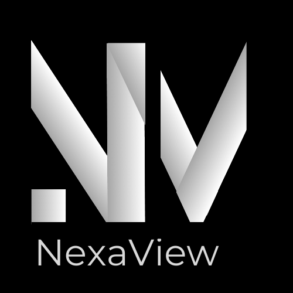

# NexaView Emloyee Intranet 👥👥💼 

### A fictive company's intranet build on Umbraco, Razor, and vue.JS, with automating scripts and CI/CD.

### Iteration Backlog
[NexaView Employee Intranet Iterations](https://github.com/users/mariellelilja/projects/12/views/1?pane=info)
([]([)

### CI/CD runs 🔄
[Project Workflows, Github Actions](https://github.com/mariellelilja/IntraHub/actions)

### Automation ⚙
I have written scripts for:
- automatic changing updated web resource references
- automatic building and running the application (or do it manually, see steps below):

### Run as Umbraco with embedded Vue
1. Navigate to vue application and build it
```
cd IntraUmbracoProject\IntraUmbracoProject\ClientApp\app
npm run build
```
2a. Once buildt, navigate to MainPage.cshtml to manually update reference hashes in filenames of the stylesheet tag and script tag...:
```
cd IntraUmbracoProject\IntraUmbracoProject\Views
```
2b. ...to adhere to file names in wwwroot of Umbraco project, as in the folders css and js: 
```
cd IntraUmbracoProject\IntraUmbracoProject\wwwroot\css
```
```
cd IntraUmbracoProject\IntraUmbracoProject\wwwroot\js
```
The file path should look like the following, with a new hash if files are changed:
- "~/css/app.{hash}.css"
- "~/js/app.{hash}.js"

3. Run Umbraco
```
cd IntraUmbracoProject\
dotnet run
```

### Run Vue frontend app separately

#### Compiles and hot-reloads for development
```
npm run serve
```

#### Compiles and minifies for production
```
npm run build
```
